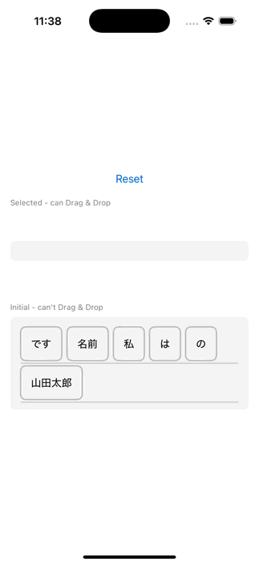

# SwiftUI Drag & Drop Sample

A sample application implementing drag and drop functionality in SwiftUI. You can drag words to rearrange their order or move them between different areas.

## Demo

## Features

- Drag and drop word cards
- Move between selection area and initial area
- Rearrange within the selection area
- Animated UI display

## Implementation Details

- Uses SwiftUI's `onDrag` and `onDrop` APIs
- Custom `DropDelegate` implementation
- Management of multiple drop zones

## Requirements

- Swift 5.10
- Xcode 16.0

## Usage

1. Clone the project
2. Open the project in Xcode
3. Run on simulator or physical device
